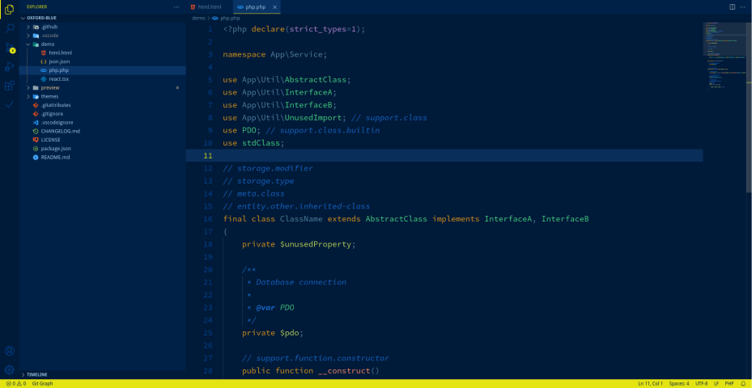
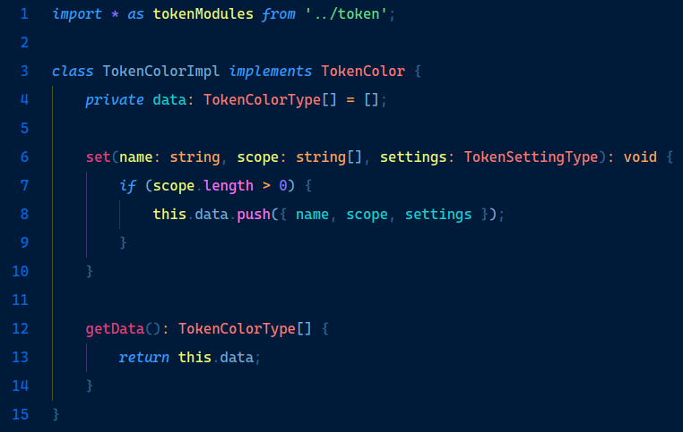
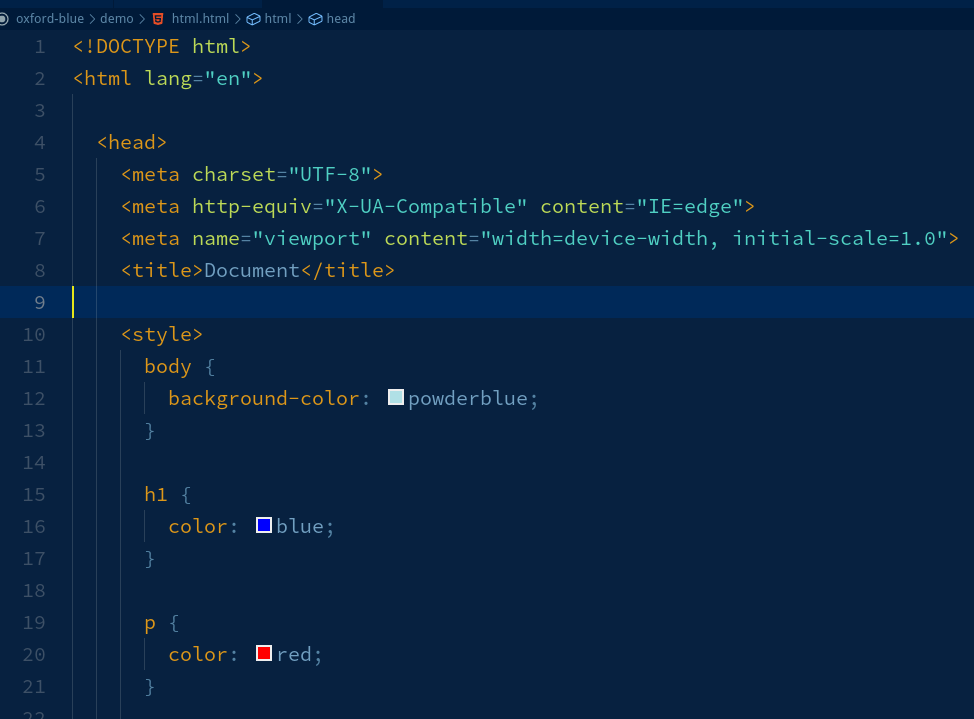
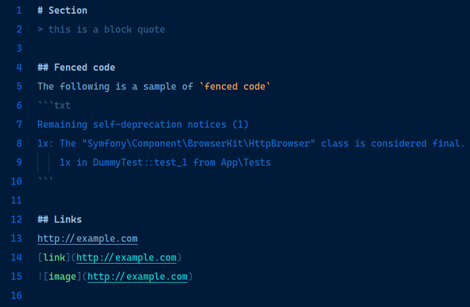

# `oxford-blue`: Visual Studio Code (vscode) Dark Theme


[](https://marketplace.visualstudio.com/items?itemName=asispts.oxford-blue)
[](https://marketplace.visualstudio.com/items?itemName=asispts.oxford-blue)
[](https://marketplace.visualstudio.com/items?itemName=asispts.oxford-blue)
[](https://open-vsx.org/extension/asispts/oxford-blue)
[](https://open-vsx.org/extension/asispts/oxford-blue)


> A stylish VSCode dark theme for PHP, TypeScript, and frontend development


`oxford-blue` is a Visual Studio Code (VSCode) dark theme designed primarily for `PHP`, `TypeScript`, and frontend developers. It aims to provide a comfortable coding experience with a carefully selected color palette, ensuring high readability and an appealing aesthetic. If you find that the theme doesn't look optimal in your preferred languages, please feel free to provide feedback.


## Installation
To install `oxford-blue` theme, follow these steps:
1. Launch VS Code Quick Open (`ctrl+p`).
2. Paste the following command and press Enter:
```txt
ext install asispts.oxford-blue
```

## Preview (VSCode Web)
You can preview the theme using the VSCode web version by following this link: [preview](https://vscode.dev/theme/asispts.oxford-blue/oxford-blue)


## Screenshots
Please note that the screenshots provided below may not fully showcase the theme's capabilities and may vary based on your specific setup and configurations.

1. `PHP` preview




2. `TypeScript` preview




3. `HTML` preview




4. `Markdown` preview




## Feedback and Contributions
If you encounter any issues, have suggestions, or would like to contribute, please feel free to:
* [Open an issue](https://github.com/asispts/oxford-blue/issues/new/choose) on the GitHub repository.
* [Submit a pull request](https://github.com/asispts/oxford-blue/pulls)

Your feedback and contributions are highly appreciated!


## License
This theme is licensed under the [MIT License](./LICENSE).

---
Happy coding!
