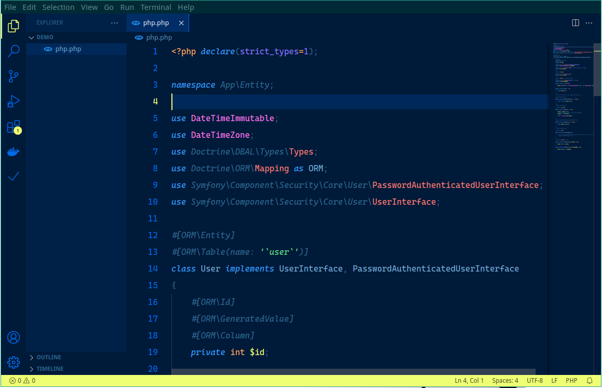

# Oxford-blue Theme for vscode

[](https://marketplace.visualstudio.com/items?itemName=asispts.oxford-blue)
[](https://open-vsx.org/extension/asispts/oxford-blue)


```txt
              ____               __   __    __
  ____  _  __/ __/___  _________/ /  / /_  / /_  _____
 / __ \| |/_/ /_/ __ \/ ___/ __  /  / __ \/ / / / / _ \
/ /_/ />  </ __/ /_/ / /  / /_/ /  / /_/ / / /_/ /  __/
\____/_/|_/_/  \____/_/   \__,_/  /_.___/_/\__,_/\___/
```

Yet another Visual Studio Code (vscode) dark theme.
---

`oxford-blue` is created mainly with `PHP` and frontend languages in mind.
Feel free to send a feedback when it looks ugly in your preferred languages.

## Installation
Launch VS Code Quick Open (`Ctrl+P`), paste the following command, and press enter.
```bash
ext install asispts.oxford-blue
```


## Preview


