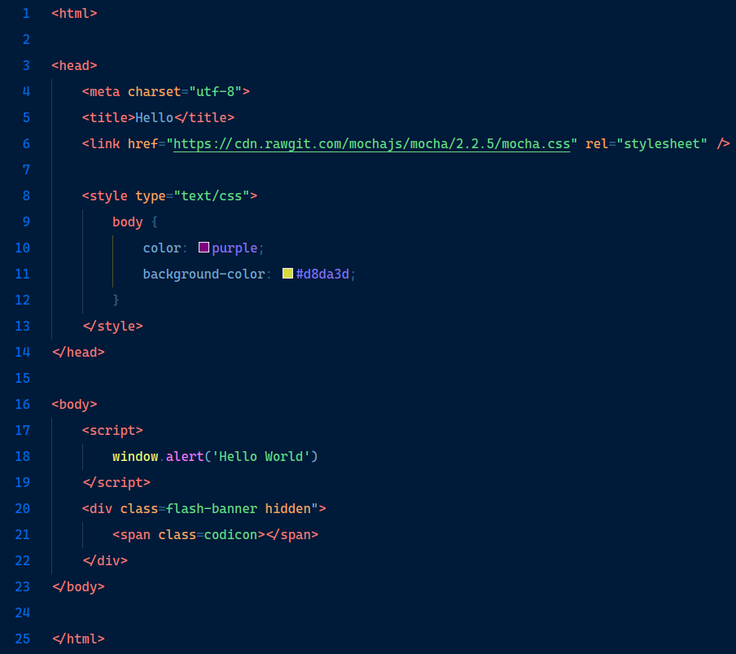

# Oxford Blue
```txt
              ____               __   __    __
  ____  _  __/ __/___  _________/ /  / /_  / /_  _____
 / __ \| |/_/ /_/ __ \/ ___/ __  /  / __ \/ / / / / _ \
/ /_/ />  </ __/ /_/ / /  / /_/ /  / /_/ / / /_/ /  __/
\____/_/|_/_/  \____/_/   \__,_/  /_.___/_/\__,_/\___/
```


Yet another Visual Studio Code (vscode) dark theme.

---

`oxford-blue` is created mainly with `PHP` and frontend languages in mind.
Feel free to send a feedback when it looks ugly in your preferred languages.

## Preview

- `PHP`


- `HTML`


- `reactjs`

